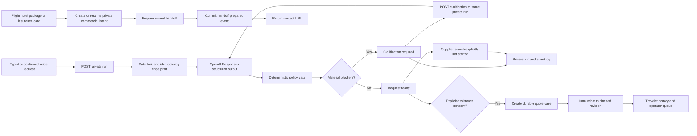

# Tra-Vel Agent Core

Status: production-safe interpretation, revision, durable intent, and assisted-request slice
TripRequest contract version: `1.1.0`
AgentRun and RunEvent envelope contract version: `1.0.0`
QuoteCase traveler DTO contract version: `1.1.0`; QuoteCaseEvent contract version: `1.1.0`
CommercialIntent and CommercialIntentEvent contract version: `1.0.0`
AssistedProposal and AssistedProposalSource contract version: `1.0.0`
Plugin: `plugin/tra-vel-agent-core/` version `0.7.0`

## What this slice does

The Agent Core accepts a typed or confirmed voice request through JSON POST, creates a private time-limited run, asks OpenAI to interpret the request into a strict `TripRequest`, applies deterministic clarification rules, and records append-only events that the interface can display. Every model clarification must identify a supported canonical `TripRequest` field, which lets policy collapse duplicate questions without weakening a blocking requirement. When material information is missing or the traveler changes a planning constraint, `POST /runs/{run_id}/messages` revises that request in place without creating a second run.

Version 0.4.0 publishes TripRequest 1.1.0 and adds a closed planning context to the private run. A destination or arbitrary Earth click receives a stable `selection_id`; map points require validated latitude and longitude, while destination coordinates are either a complete validated pair or both null. Intent and the canonical eight-domain scope travel with the structured request and remain unchanged during natural-language revisions unless a future authorized action explicitly replaces the selection. Public creation events record the context kind and stable selection identity, not exact coordinates.

Version 0.4.1 adds resumable account history without widening run disclosure. `GET /runs` binds ownership exclusively to the current signed-in WordPress user with the `read` capability, never accepts an owner ID, excludes guest and expired rows in SQL, defaults to 12 results with a hard cap of 20, and orders equal update times by descending internal primary key. Every item is reduced to the closed `AgentRunSummary` contract: run identity and state, the bounded summary/planning/readiness projection, request revision, actual proposal-array count, timestamps, and resume truth. Provider state, owner fields, tokens, internal IDs, inputs, full requests, proposal bodies, events, and approvals are omitted. A failed database read returns `503` instead of looking like an empty account.

Version 0.5.0 closes the gap between a useful result card and a measurable commercial handoff. A flight, hotel, package, or insurance CTA first creates or resumes a private `CommercialIntent`; it then prepares a handoff under that exact intent and commits `handoff.prepared` before returning a URL. The intent stores only bounded trip and candidate identity, never a browser-claimed numeric price, medical answer, traveler age, passport, contact detail, payment field, raw prompt, or transactional outcome. Browser supplier claims are retained only as requested provenance; until a server-verifiable immutable supplier reference exists, the resolved channel is the owned Tra-Vel concierge. This keeps the interface rich while making final price, availability, inclusions, and terms explicitly subject to the personal quote.

The seven-stage traveler display is a projection of current run status and append-only events. Requested domains come first from `planning_context.scope`, then from interpreted `search_scope` only when no explicit scope was carried. A domain can show running or completed only when a matching supplier-search event identifies that domain. Network failure freezes the last confirmed state and stops progress motion; it does not create a completed or failed supplier event by itself.

The durable `QuoteCase` aggregate introduced in 0.3.0 remains separate from the short-lived AI run. A quote case freezes minimized, immutable request revisions, provides an exact-owner traveler history, and powers a capability-protected operator queue. AI working state and commercial-assistance state remain separate: an `AgentRun` expires after 24 hours, while an active quote case has a 30-day service window and a normal 90-day deletion boundary.

Traveler-facing QuoteCase 1.1.0 summaries include `resume_available`. The versioned schema identity prevents the new required field from silently changing the closed QuoteCase 1.0.0 shape. QuoteCaseEvent 1.1.0 adds an integrity-only SHA-256 target digest so a prepared assisted-contact event is bound to the exact URL returned to the traveler without retaining that URL in the durable event. `resume_available` is true only when the source AgentRun still exists, is unexpired, belongs to the exact same owner, and the current traveler can still access it. Quote lists resolve source ownership in one bounded batch. Missing or expired source rows, owner disagreement, database uncertainty, and operator projections all fail to false. A durable quote remains readable after its 24-hour source plan expires; it simply cannot claim that the short-lived AI plan can be resumed.

It is intentionally narrower than the complete travel agent. Creating or updating a quote case does not claim that suppliers were searched, prices were quoted, inventory was held, a message was delivered, or a booking was made. When no contracted supplier tool has executed, the run records `supplier.search.not_started` with `provider_connected: false` and `provider_bookable: false`. Quote-case statuses are limited to truthful assistance states such as `queued`, `in_review`, `needs_information`, and `ready_for_assistance`.

The full state, retention, privacy, handoff, motion, and recovery contracts are documented in [Tra-Vel assisted quote cases](QUOTE_CASE_OPERATIONS.md), [Tra-Vel durable commercial intent](COMMERCIAL_INTENT_SYSTEM.md), and [Tra-Vel sourced assisted proposals](ASSISTED_PROPOSAL_SYSTEM.md).

## Runtime boundary

WordPress is the ownership and audit control plane. The OpenAI model interprets language but cannot promote demo data, set supplier provenance, mark an offer bookable, or execute a consequential action.

## REST routes

Namespace: `/wp-json/tra-vel-agent/v1`

| Method | Route | Access | Purpose |
| --- | --- | --- | --- |
| `GET` | `/health` | Public, safe metadata only | Plugin, provider, and capability state |
| `GET` | `/schema/trip-request` | Public | Versioned public `TripRequest` schema |
| `GET` | `/schema/agent-run-summary` | Public | Closed account plan-history item schema |
| `GET` | `/schema/commercial-intent` | Public | Closed non-binding commercial-intent schema |
| `POST` | `/runs` | Public HTTPS, rate limited | Create and interpret a private run |
| `GET` | `/runs` | Signed-in user with `read` | List 12 by default, up to 20 unexpired plans owned by the exact current account |
| `GET` | `/runs/{uuid}` | HttpOnly ownership cookie or logged-in owner | Read private run state |
| `GET` | `/runs/{uuid}/events` | HttpOnly ownership cookie or logged-in owner | Read append-only events after a sequence |
| `POST` | `/runs/{uuid}/messages` | HttpOnly ownership cookie or logged-in owner | Apply a typed or confirmed-voice clarification to the same private run |
| `POST` | `/runs/{uuid}/quote-cases` | Run owner with explicit consent | Create or replay one durable assisted request for the current request revision |
| `GET` | `/quote-cases` | HttpOnly quote-owner cookie or logged-in owner | List the traveler's owned assisted requests |
| `GET` | `/quote-cases/{uuid}` | Exact quote-case owner | Read one minimized case summary |
| `GET` | `/quote-cases/{uuid}/events` | Exact quote-case owner | Read traveler-visible persisted events after a sequence |
| `POST` | `/quote-cases/{uuid}/cancel` | Exact quote-case owner | Cancel an active request using its expected version |
| `POST` | `/quote-cases/{uuid}/claim` | Logged-in user with matching guest-owner cookie | Move a guest case to the exact account owner |
| `POST` | `/quote-cases/{uuid}/handoffs` | Exact quote-case owner | Prepare an allowlisted assisted handoff and record that preparation only |
| `POST` | `/commercial-intents` | Same-origin visitor; rate limited | Create or resume a private result-card verification intent |
| `GET` | `/commercial-intents/{uuid}` | Exact account or private-browser owner | Read the safe owned intent projection |
| `POST` | `/commercial-intents/{uuid}/handoffs` | Exact owner and expected version | Record a prepared handoff, then return the allowlisted owned URL |
| `POST` | `/vip/intakes` | Exact HTTPS same-origin browser; signed-in cookies also require a REST nonce | Accept an already-vaulted, server-classified incident envelope and return a private Trip Care receipt |
| `GET` | `/vip/intakes/{TVR-reference}` | Exact account or private-browser receipt owner | Read one minimized Trip Care receipt without exposing message, trip, contact, or supplier data |
| `GET` | `/customer-trip-cockpit/current` | Explicit signed-in account mode with REST nonce, or exact scoped-session mode with the private capability cookie | Return the current validated 21-field customer Trip Cockpit view; no trip selector, private projection, scope, or mutation input is accepted |
| `GET` | `/operator/quote-cases` | `tra_vel_view_quote_cases` | Read the paginated operator queue |
| `GET` | `/operator/quote-cases/{uuid}` | `tra_vel_view_quote_cases` | Read operator case detail and history |
| `POST` | `/operator/quote-cases/{uuid}/transitions` | Quote management capability; assignment also requires assign capability | Apply an allowed, version-checked state transition |
| `POST` | `/runs/{uuid}/approvals/{uuid}` | Logged-in owner only | Decide one frozen, versioned action |
| `POST` | `/settings/credential` | Administrator | Store encrypted OpenAI fallback credential |
| `DELETE` | `/settings/credential` | Administrator | Delete only the encrypted fallback credential |

Private responses use `Cache-Control: private, no-store, max-age=0` and `X-Robots-Tag: noindex, nofollow, noarchive`.

The VIP POST route is an attested normalization bridge, not a browser-facing free-text endpoint. A server-side message vault and classifier must verify durable storage, issue a five-minute HMAC attestation over the exact closed envelope and vault reference, and keep the signer out of REST. Until that upstream adapter exists, health reports `raw_trip_care_intake=false`. The bridge grants no reservation, cancellation, payment, refund, supplier, trip-match, or sensitive-disclosure authority.

## Server-only Trip Cockpit materialization

The customer Trip Cockpit has a separate write bridge with no REST route. After a registration, booking, post-booking service, supplier reconciliation, payment/refund/settlement, Trip Care, traveler-readiness, loyalty, offline-pack, or local-service transaction commits, trusted server code fires `tra_vel_customer_trip_cockpit_authoritative_lifecycle_event` with only the exact owner ID, trip reference, closed event kind, and opaque lifecycle-event reference. The event never carries a source bundle, viewing scope, revision, owner digest, or customer projection.

`Tra_Vel_Customer_Trip_Cockpit_Source_Assembler` derives the account and keyed owner scope, resolves an implementation of `Tra_Vel_Customer_Trip_Cockpit_Source_Provider` through `tra_vel_customer_trip_cockpit_source_provider`, and asks it for the current closed customer-safe component snapshot. A provider is expected to join already validated registration, servicing, commerce, incident, loyalty, traveler-readiness, and offline-pack projections from their durable server repositories. No provider means no write; there is no fixture or synthetic fallback in plugin runtime.

The assembler derives the cockpit identity, observation clock, revision, and exact predecessor digest. It validates the complete private source before opening a one-call authorization window for `commit_server_source`. That authorization is bound to the exact owner, account, trip, and canonical source digest and closes in a `finally` block. An exact semantic replay returns the existing projection without creating a revision; a real successor must satisfy the store's immutable ancestry and affected-service rules. Browser code cannot select the provider, submit the snapshot, invoke the write store through REST, or widen customer-view scopes.

## Ownership

- Every run receives a 256-bit random bearer token. Only its SHA-256 hash is stored.
- The token is never returned in JSON or exposed to JavaScript. Creation sets a `Secure`, `HttpOnly`, `SameSite=Lax`, `__Host-` ownership cookie, while the tab keeps only the non-secret run UUID in `sessionStorage`.
- A logged-in user can access a run only when `owner_user_id` matches.
- Account history is hard-bound to `get_current_user_id()`, requires the `read` capability, excludes owner ID request parameters, guest rows, and expired rows, and uses `updated_at DESC, id DESC` ordering.
- Account history returns only the closed resume DTO and uses private, no-store, noindex response headers. Database read uncertainty returns `503`.
- Anonymous runs expire after 24 hours and are deleted by a bounded daily cleanup job.
- Anonymous Trip Care receipts use a separate `Secure`, `HttpOnly`, `SameSite=Strict`, `__Host-` owner cookie, remain readable for 30 days, and are removed under a bounded 90-day retention policy unless an authorized legal hold applies.
- Guests cannot approve purchases, cancellations, amendments, personal-data submission, insurance binding, or supplier requests.
- The customer Trip Cockpit repository derives its owner scope with a server-keyed HMAC, preserves immutable revisions, revalidates every duplicated row binding and projection seal on read, and has no public write route. A whole-trip scoped view requires an exact trip/account capability with a null case binding; a case-specific capability cannot widen into sibling-case access.
- Quote cases never reuse the short-lived run bearer. Guests receive a separate 256-bit quote-owner secret in `__Host-tra_vel_quote_owner`; only its SHA-256 hash is stored.
- Signed-in quote cases belong to the exact WordPress user ID. A guest case can be claimed only while the matching guest cookie is present.
- If the response that sets a new quote-owner cookie is lost, a retry can recover only the case attached to the same already-authorized source run. Recovery rotates guest ownership or links the case to the signed-in owner and records a public recovery event; knowing a case UUID is insufficient.
- Before any quote owner token, replay row, or recovery event is written, an atomic source-run allowance permits four accepted create/recovery attempts per day by default; a second visitor/account window permits twelve per ten minutes. Exhaustion is a truthful `429` and leaves the existing owner and history unchanged.
- Public quote-case responses omit owner hashes, internal IDs, assignment internals, consent metadata, full snapshots, and legal-hold state.
- Quote-case `resume_available` is derived from a batched live source-run ownership check and defaults to false on expiry, absence, owner mismatch, or read uncertainty.
- Commercial intents use a separate `__Host-tra_vel_commercial` Secure, HttpOnly, SameSite cookie for guests and the exact WordPress user ID for accounts. Cross-origin guest mutations are rejected, and the owner secret is never returned to JavaScript.
- Create and handoff operations require independent idempotency keys. An ambiguous timeout reuses its key; a confirmed later handoff uses a new key and version.

## Clarification and request revisioning

- A clarification is accepted only for the same owned private run while its status is `needs_clarification` or `request_ready`. It never creates a parallel conversation or a second run.
- Every accepted update preserves the existing `TripRequest.request_id` and increments `TripRequest.revision` by exactly one. The provider must return a complete replacement request; the prior request remains authoritative if provider or deterministic policy validation fails.
- The raw clarification is processed in memory and is never written to the run or event tables. The audit event stores only bounded metadata, including input kind, target revision and the clarification SHA-256 hash.
- Tra-Vel sends the provider a sanitized structured view of the prior `TripRequest` together with the current clarification. Internal policy metadata is excluded, and the Responses API continues to use `store: false`, so revisioning does not depend on provider-retained conversation state.
- Typed messages and confirmed voice transcripts share the same policy gates. An unconfirmed voice transcript cannot revise a request.
- `client_request_id` provides per-run revision idempotency, and a run lease prevents concurrent updates from racing.
- The default maximum request revision number is 8. `tra_vel_agent_max_request_revisions` may change it only within the enforced range of 2 through 20; after the limit, the traveler must start a new private plan.

## Provider truth rules

- Initial interpretations and in-place revisions use `store: false` and a strict JSON Schema. A revision supplies structured prior context again instead of relying on provider-side conversation storage.
- Each interpretation is capped at 1,600 output tokens, at five requests per visitor per ten minutes, and at 20 live requests per UTC day by default. At the official 2026-07-16 standard price for GPT-5.6 Terra, the worst-case output ceiling is about USD 0.024 per call before input, while the verified structured test used 382 output tokens. Atomic owner-token leases allow at most two concurrent provider calls, and both traffic counters reserve capacity with conditional database writes, so a parallel burst cannot occupy all PHP workers or step past the limits. These operational limits remain filterable without changing the public contract.
- The system instruction forbids invented dates, ages, budgets, certification, accessibility requirements, prices, availability, savings, reservations, and bookings.
- Provider errors are normalized and stored without the API key or raw supplier payloads.
- A deterministic policy pass blocks supplier work when a voice transcript is unconfirmed, no adult or origin is known, or child ages do not match the stated child count.
- Structured output is request interpretation only. Supplier tools and price calculations require independent evidence and events.

Current default model: `gpt-5.6-terra`, selected for the current balance of reasoning quality and operating cost. The model can be replaced with the `tra_vel_agent_openai_model` filter.

Official implementation references:

- [OpenAI Agents SDK overview](https://developers.openai.com/api/docs/guides/agents)
- [OpenAI Structured Outputs](https://developers.openai.com/api/docs/guides/structured-outputs)
- [OpenAI human-in-the-loop approvals](https://openai.github.io/openai-agents-js/guides/human-in-the-loop/)
- [GPT-5.6 Terra model and pricing](https://developers.openai.com/api/docs/models/gpt-5.6-terra)

## Credential storage

Credential precedence:

1. `TRA_VEL_OPENAI_API_KEY` in `wp-config.php`
2. server `OPENAI_API_KEY` environment variable
3. sodium-encrypted WordPress option configured through the administrator-only endpoint

The key is never returned by REST, written to Git, bundled into the ZIP, or printed by the configuration helper. The local development key lives in ignored `.env.local`. `scripts/wp/configure-agent-key.ps1` transfers it to production over HTTPS using the existing WordPress Application Password and clears plaintext variables after the request.

## Data tables

- `{prefix}tra_vel_agent_runs`: ownership, request state, provider reference, expiry; neither the raw initial prompt nor raw clarification messages are stored
- `{prefix}tra_vel_agent_events`: append-only ordered audit events
- `{prefix}tra_vel_agent_approvals`: frozen action snapshot, digest, version, expiry, decision
- `{prefix}tra_vel_agent_limits`: atomic visitor-window and UTC-day cost reservations
- `{prefix}tra_vel_quote_cases`: durable case identity, opaque `TV-XXXXXXXX` reference, exact owner, state/version, assignment, activity, expiry, and retention boundary
- `{prefix}tra_vel_quote_case_revisions`: immutable minimized `TripRequest` snapshots and SHA-256 digests
- `{prefix}tra_vel_quote_case_events`: append-only ordered traveler/operator history with bounded payloads and payload digests
- `{prefix}tra_vel_quote_case_idempotency`: replay protection for create, transition, cancel, claim, expiry, and handoff preparation
- `{prefix}tra_vel_commercial_intents`: owned non-binding trip/candidate scope, digest, optimistic version, expiry, and retention boundary
- `{prefix}tra_vel_commercial_intent_events`: immutable ordered `commercial_intent.created` and `handoff.prepared` evidence
- `{prefix}tra_vel_commercial_intent_idempotency`: exact create/resume and handoff replay protection without retaining outbound URLs

Approvals and quote cases do not execute supplier side effects in this slice. Quote-case mutations use transactions, expected aggregate versions, atomic event sequences, and idempotency keys. Same-key concurrent retries replay the committed winner after rollback. Source synchronization is monotonic: an exact digest never resets operator progress, only a strictly newer source revision may freeze a new case revision, and the SQL update repeats that revision guard beside the aggregate-version compare-and-swap. Transient authoritative reads are requeued and true absence remains a no-op. Durable revisions contain only bounded route, date, traveler, budget, scope, and readiness fields; model summaries, prompts, preferences, constraints, contact data, sensitive data, and provider traces are excluded. Future supplier tools still require adapter-specific idempotency and must record `side_effect.started` and one terminal evidence event.

Traveler case details embed at most 20 public events, preserving creation plus the latest activity. Traveler and operator event routes use an `after` sequence cursor, cap `limit` at 50, and return `last_sequence` with `has_more`. Assisted WhatsApp preparations reuse a matching current-version link for five minutes and permit at most six new preparations per rolling hour.

The retention job expires active service cases through the normal versioned mutation path. It deletes 90-day aggregates without legal hold in bounded, locked transactions that remove replay rows, events, revisions, and the parent together, then performs bounded checked sweeps for stale replay rows and historical orphan revision/event children. AgentRun cleanup likewise deletes each expired aggregate transactionally and heals orphan events/approvals. Every cleanup read distinguishes a database failure from an empty result and records operational status. Runtime routes and cross-store synchronization fail closed unless both four-table schemas have their required columns, transactional engines, and concurrency indexes.

## Operator capabilities

- `tra_vel_view_quote_cases` reads the queue and case detail.
- `tra_vel_manage_quote_cases` applies legal case-state changes.
- `tra_vel_assign_quote_cases` is additionally required to take a case into review.
- `tra_vel_dispatch_supplier_requests` is deliberately separate and is not granted to the `tra_vel_quote_operator` role.

Administrators receive all four capabilities. Quote operators receive view, manage, and assign only. No current quote-case route dispatches a supplier request.

## Protected delivery

`scripts/ci/build_agent_core.py` creates a deterministic, versioned ZIP and SHA-256 manifest. The fixed-scope deploy gateway accepts only `tra-vel-agent-core/tra-vel-agent-core.php`, requires administrator plugin capabilities, an exact server-side deployment phrase, a matching checksum, a higher semantic version, and a single fixed ZIP root. It takes a release backup before overwrite, automatically restores the prior active plugin after an install or activation failure, and exposes a separately confirmed rollback route. The GitHub workflow rolls back the returned backup when the post-deploy public health contract, Agent, quote-case, commercial-intent, or assisted-proposal schema, or authenticated operator-queue smoke test fails.

Initial installation uses `scripts/wp/bootstrap-agent-core.ps1` with the exact `INSTALL TRA-VEL AGENT CORE` phrase. It refuses to overwrite an existing Agent Core installation, uses an atomic owner-token lease, validates the package twice, verifies public health, and removes its temporary Code Snippets installer. `scripts/wp/configure-agent-key.ps1` then transfers the ignored local key to the administrator-only encrypted credential route without printing it.

## Live provider verification

Billing was enabled on 2026-07-16. The secured project key then passed both a minimal Responses API smoke test and the production strict `TripRequest` schema. The structured test correctly preserved an open destination, two adults, a USD 1,000 budget, and returned material questions rather than fabricating missing dates, prices, availability, or bookings. The production credential is configured only during the protected WordPress deployment step.

The OpenAI adapter is a boundary, not the product authority. A second OpenAI-compatible or open-model provider can implement `Tra_Vel_Agent_Provider` and be selected through the trusted `tra_vel_agent_request_provider` WordPress filter; WordPress remains responsible for ownership, policy, events, approvals, supplier provenance, and cost controls.

## Next slices

1. Bridge read-only flight, hotel, package, weather, and destination tools through existing repositories.
2. Attach sourced, immutable assisted proposals to durable quote cases with strict cost ledgers, evidence, expiry, traveler review, and no purchase state.
3. Add adapter-specific supplier idempotency, approval, reconciliation, and recovery before any supplier-side action.
4. Add evidence-bearing proposal and delivery records before introducing `proposal_ready`, `sent`, price, reservation, payment, or booking states.
5. Move supplier repositories out of the theme so backend behavior survives a theme switch.
6. Introduce a TypeScript or Python Agents SDK orchestration service when long-running pause/resume and supplier fan-out require it, while WordPress remains the ownership and approval authority.
