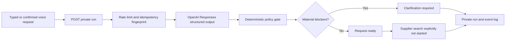

# Tra-Vel Agent Core

Status: first production-safe vertical slice in implementation  
Contract version: `1.0.0`  
Plugin: `plugin/tra-vel-agent-core/`

## What this slice does

The Agent Core accepts a typed or confirmed voice request through JSON POST, creates a private time-limited run, asks OpenAI to interpret the request into a strict `TripRequest`, applies deterministic clarification rules, and records append-only events that the interface can display.

It is intentionally narrower than the complete travel agent. It does not claim that suppliers were searched, prices were quoted, inventory was held, or a booking was made. When no contracted supplier tool has executed, the run records `supplier.search.not_started` with `provider_connected: false` and `provider_bookable: false`.

## Runtime boundary

WordPress is the ownership and audit control plane. The OpenAI model interprets language but cannot promote demo data, set supplier provenance, mark an offer bookable, or execute a consequential action.

## REST routes

Namespace: `/wp-json/tra-vel-agent/v1`

| Method | Route | Access | Purpose |
| --- | --- | --- | --- |
| `GET` | `/health` | Public, safe metadata only | Plugin, provider, and capability state |
| `GET` | `/schema/trip-request` | Public | Versioned public `TripRequest` schema |
| `POST` | `/runs` | Public HTTPS, rate limited | Create and interpret a private run |
| `GET` | `/runs/{uuid}` | HttpOnly ownership cookie or logged-in owner | Read private run state |
| `GET` | `/runs/{uuid}/events` | HttpOnly ownership cookie or logged-in owner | Read append-only events after a sequence |
| `POST` | `/runs/{uuid}/approvals/{uuid}` | Logged-in owner only | Decide one frozen, versioned action |
| `POST` | `/settings/credential` | Administrator | Store encrypted OpenAI fallback credential |
| `DELETE` | `/settings/credential` | Administrator | Delete only the encrypted fallback credential |

Private responses use `Cache-Control: private, no-store, max-age=0` and `X-Robots-Tag: noindex, nofollow, noarchive`.

## Ownership

- Every run receives a 256-bit random bearer token. Only its SHA-256 hash is stored.
- The token is never returned in JSON or exposed to JavaScript. Creation sets a `Secure`, `HttpOnly`, `SameSite=Lax`, `__Host-` ownership cookie, while the tab keeps only the non-secret run UUID in `sessionStorage`.
- A logged-in user can access a run only when `owner_user_id` matches.
- Anonymous runs expire after 24 hours and are deleted by a bounded daily cleanup job.
- Guests cannot approve purchases, cancellations, amendments, personal-data submission, insurance binding, or supplier requests.

## Provider truth rules

- The OpenAI request uses `store: false` and a strict JSON Schema.
- Each interpretation is capped at 1,600 output tokens, at five requests per visitor per ten minutes, and at 20 live requests per UTC day by default. At the official 2026-07-16 standard price for GPT-5.6 Terra, the worst-case output ceiling is about USD 0.024 per call before input, while the verified structured test used 382 output tokens. Atomic owner-token leases allow at most two concurrent provider calls, and both traffic counters reserve capacity with conditional database writes, so a parallel burst cannot occupy all PHP workers or step past the limits. These operational limits remain filterable without changing the public contract.
- The system instruction forbids invented dates, ages, budgets, certification, accessibility requirements, prices, availability, savings, reservations, and bookings.
- Provider errors are normalized and stored without the API key or raw supplier payloads.
- A deterministic policy pass blocks supplier work when a voice transcript is unconfirmed, no adult or origin is known, or child ages do not match the stated child count.
- Structured output is request interpretation only. Supplier tools and price calculations require independent evidence and events.

Current default model: `gpt-5.6-terra`, selected for the current balance of reasoning quality and operating cost. The model can be replaced with the `tra_vel_agent_openai_model` filter.

Official implementation references:

- [OpenAI Agents SDK overview](https://developers.openai.com/api/docs/guides/agents)
- [OpenAI Structured Outputs](https://developers.openai.com/api/docs/guides/structured-outputs)
- [OpenAI human-in-the-loop approvals](https://openai.github.io/openai-agents-js/guides/human-in-the-loop/)
- [GPT-5.6 Terra model and pricing](https://developers.openai.com/api/docs/models/gpt-5.6-terra)

## Credential storage

Credential precedence:

1. `TRA_VEL_OPENAI_API_KEY` in `wp-config.php`
2. server `OPENAI_API_KEY` environment variable
3. sodium-encrypted WordPress option configured through the administrator-only endpoint

The key is never returned by REST, written to Git, bundled into the ZIP, or printed by the configuration helper. The local development key lives in ignored `.env.local`. `scripts/wp/configure-agent-key.ps1` transfers it to production over HTTPS using the existing WordPress Application Password and clears plaintext variables after the request.

## Data tables

- `{prefix}tra_vel_agent_runs`: ownership, request state, provider reference, expiry; the raw natural-language prompt is never stored
- `{prefix}tra_vel_agent_events`: append-only ordered audit events
- `{prefix}tra_vel_agent_approvals`: frozen action snapshot, digest, version, expiry, decision
- `{prefix}tra_vel_agent_limits`: atomic visitor-window and UTC-day cost reservations

Approvals do not execute side effects in this slice. Future supplier tools must use an additional atomic idempotency ledger and must record `side_effect.started` and one terminal event.

## Protected delivery

`scripts/ci/build_agent_core.py` creates a deterministic, versioned ZIP and SHA-256 manifest. The fixed-scope deploy gateway accepts only `tra-vel-agent-core/tra-vel-agent-core.php`, requires administrator plugin capabilities, an exact server-side deployment phrase, a matching checksum, a higher semantic version, and a single fixed ZIP root. It takes a release backup before overwrite, automatically restores the prior active plugin after an install or activation failure, and exposes a separately confirmed rollback route. The GitHub workflow also rolls back the returned backup when the post-deploy public health contract fails.

Initial installation uses `scripts/wp/bootstrap-agent-core.ps1` with the exact `INSTALL TRA-VEL AGENT CORE` phrase. It refuses to overwrite an existing Agent Core installation, uses an atomic owner-token lease, validates the package twice, verifies public health, and removes its temporary Code Snippets installer. `scripts/wp/configure-agent-key.ps1` then transfers the ignored local key to the administrator-only encrypted credential route without printing it.

## Live provider verification

Billing was enabled on 2026-07-16. The secured project key then passed both a minimal Responses API smoke test and the production strict `TripRequest` schema. The structured test correctly preserved an open destination, two adults, a USD 1,000 budget, and returned material questions rather than fabricating missing dates, prices, availability, or bookings. The production credential is configured only during the protected WordPress deployment step.

The OpenAI adapter is a boundary, not the product authority. A second OpenAI-compatible or open-model provider can implement `Tra_Vel_Agent_Provider` and be selected through the trusted `tra_vel_agent_request_provider` WordPress filter; WordPress remains responsible for ownership, policy, events, approvals, supplier provenance, and cost controls.

## Next slices

1. Add message and clarification resolution with request revisioning.
2. Bridge read-only flight, hotel, package, weather, and destination tools through existing repositories.
3. Generate three materially different proposals with strict cost ledgers and provenance.
4. Add a dedicated idempotency table before any supplier-side action.
5. Allow only the existing verified concierge handoff as the first protected commercial action.
6. Move supplier repositories out of the theme so backend behavior survives a theme switch.
7. Introduce a TypeScript or Python Agents SDK orchestration service when long-running pause/resume and supplier fan-out require it, while WordPress remains the ownership and approval authority.
