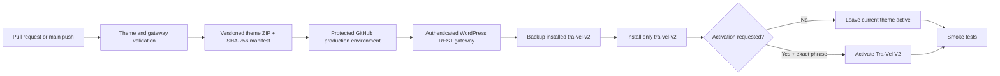

# Tra-Vel V2 deployment pipeline

Status: implemented for direct deployment to `https://tra-vel.co.il`. No uPress development environment is used.

## Delivery model



The existing production theme is not overwritten. Upload and activation are separate actions.

## One-time WordPress gateway

Source: `plugin/tra-vel-deploy-gateway/`

The gateway is installed once as a normal WordPress plugin. It accepts WordPress Application Password authentication over HTTPS and checks both `install_themes` and `update_themes` capabilities. `scripts/wp/bootstrap-deploy-gateway.ps1` uses the site's existing Code Snippets REST API only as a temporary authenticated installer, then deactivates it, replaces its code with a harmless comment, moves it to trash, and attempts permanent deletion.

It enforces all of the following:

- Maximum package size: 25 MB.
- ZIP root must contain only `tra-vel-v2/`.
- Theme name must be exactly `Tra-Vel V2`.
- SHA-256 header must match the uploaded ZIP.
- Concurrent deployments are locked.
- Existing V2 is copied to `wp-content/tra-vel-v2-releases/` before overwrite.
- Ten rollback releases are retained.
- Activation requires the exact phrase `ACTIVATE TRA-VEL V2`.
- No endpoint can update another theme slug.

Authenticated routes:

| Method | Route | Purpose |
|---|---|---|
| `GET` | `/wp-json/tra-vel-deploy/v1/theme/status` | Installed version, active state, backups |
| `POST` | `/wp-json/tra-vel-deploy/v1/theme` | Validate, back up, and install V2 |
| `POST` | `/wp-json/tra-vel-deploy/v1/theme/rollback` | Restore `latest` or a named backup |

## GitHub workflows

### Theme CI

`.github/workflows/theme-ci.yml` validates theme/plugin PHP, JavaScript, shell scripts, theme policy, ZIP structure, and checksums. It publishes both installable ZIPs as artifacts.

### Direct production deploy

`.github/workflows/deploy-theme.yml` defaults to a dry run. A real upload requires:

- GitHub branch `main`.
- GitHub `production` environment approval.
- `DEPLOY_ENABLED=true`.
- Exact phrase `DEPLOY TRA-VEL V2`.
- WordPress secrets and HTTPS site URL.

Activation stays `false` unless separately requested with `ACTIVATE TRA-VEL V2`.

Automatic main-branch upload remains off until `AUTO_DEPLOY_PRODUCTION=true`. When enabled, the default `ACTIVATE_THEME=false` keeps releases upload-only.

### Rollback

`.github/workflows/rollback-theme.yml` requires production approval and `ROLLBACK TRA-VEL V2`, restores a gateway backup, and reruns smoke tests.

## GitHub production environment

Variables:

| Name | Initial value |
|---|---|
| `WP_SITE_URL` | `https://tra-vel.co.il` |
| `DEPLOY_ENABLED` | `true` after the gateway test succeeds |
| `ACTIVATE_THEME` | `false` |
| `EXPECT_THEME_MARKER` | `false` until V2 is active |
| `SMOKE_PATHS` | `/,/travel-map/,/thailand/` after those pages exist |

Secrets:

| Name | Purpose |
|---|---|
| `WP_USERNAME` | Restricted WordPress deployment username |
| `WP_APP_PASSWORD` | WordPress Application Password |

Repository variable:

| Name | Initial value |
|---|---|
| `AUTO_DEPLOY_PRODUCTION` | `false` |

## Local encrypted credential and direct test

Credential file:

`C:\Users\janana\Documents\.codex-secrets\wordpress-app-passwords\tra-vel.co.il.credential.xml`

Build and upload V2 without activating it:

```powershell
& 'C:\Users\janana\Documents\tra-vel-co-il\scripts\wp\deploy-theme-rest.ps1' `
  -SiteUrl 'https://tra-vel.co.il'
```

Activate only after validation:

```powershell
& 'C:\Users\janana\Documents\tra-vel-co-il\scripts\wp\deploy-theme-rest.ps1' `
  -SiteUrl 'https://tra-vel.co.il' `
  -Activate `
  -ActivationConfirmation 'ACTIVATE TRA-VEL V2'
```

## First live sequence

1. Install and activate the deploy gateway plugin with `scripts/wp/bootstrap-deploy-gateway.ps1`; confirm the temporary snippet is inactive and neutralized or deleted.
2. Confirm the authenticated status endpoint.
3. Upload V2 without activation.
4. Confirm installed version and checksum.
5. Create/update the map and Thailand pages through the authenticated content helper.
6. Activate V2 when the homepage and routes are ready.
7. Run public desktop/mobile and route smoke tests.
8. Enable automatic upload only after one complete manual release and rollback test.
