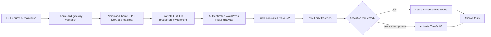

# Tra-Vel V2 deployment pipeline

Status before this release: verified on `https://tra-vel.co.il` on 2026-07-16 with deploy gateway 0.1.0 and active Tra-Vel V2 1.10.2. Gateway 0.2.0, Agent Core 0.1.0, and theme 1.11.0 are prepared for the protected release sequence below. Automatic production deployment remains off. No uPress development environment is used.

## Delivery model



The existing production theme is not overwritten. Upload and activation are separate actions.

## One-time WordPress gateway

Source: `plugin/tra-vel-deploy-gateway/`

The gateway is installed once as a normal WordPress plugin. It accepts WordPress Application Password authentication over HTTPS and exposes fixed-scope controllers for Tra-Vel V2 and Tra-Vel Agent Core only. `scripts/wp/bootstrap-deploy-gateway.ps1` uses the site's existing Code Snippets REST API only as a temporary authenticated installer, then deactivates it, replaces its code with a harmless comment, moves it to trash, and attempts permanent deletion.

It enforces all of the following:

- Maximum package size: 25 MB.
- ZIP root must contain only `tra-vel-v2/`.
- Theme name must be exactly `Tra-Vel V2`.
- SHA-256 header must match the uploaded ZIP.
- Concurrent deployments are locked.
- Existing V2 is copied to `wp-content/tra-vel-v2-releases/` before overwrite.
- Ten rollback releases are retained.
- Activation requires the exact phrase `ACTIVATE TRA-VEL V2`.
- No endpoint can update another theme slug.
- Theme and plugin deployment locks are atomic database leases with owner-conditional release.
- Server-side deployment, activation, and rollback phrases are required even when a caller bypasses GitHub Actions.
- Downgrades and changed same-version artifacts are rejected; exact repeats are idempotent.
- Failed installation or activation automatically restores the verified prior release and active state.
- WordPress filesystem initialization, staged copies, installed versions, and release fingerprints fail closed.

Authenticated routes:

| Method | Route | Purpose |
|---|---|---|
| `GET` | `/wp-json/tra-vel-deploy/v1/theme/status` | Installed version, active state, backups |
| `POST` | `/wp-json/tra-vel-deploy/v1/theme` | Validate, back up, and install V2 |
| `POST` | `/wp-json/tra-vel-deploy/v1/theme/rollback` | Restore `latest` or a named backup |
| `GET` | `/wp-json/tra-vel-deploy/v1/plugin/agent-core/status` | Installed Agent Core version, state, backups |
| `POST` | `/wp-json/tra-vel-deploy/v1/plugin/agent-core` | Validate, back up, install, and optionally activate Agent Core |
| `POST` | `/wp-json/tra-vel-deploy/v1/plugin/agent-core/rollback` | Restore a named Agent Core backup |
| `POST` | `/wp-json/tra-vel-deploy/v1/plugin/agent-core/recovery/fresh` | Remove only the exact recent failed first install |

## GitHub workflows

### Theme CI

`.github/workflows/theme-ci.yml` validates theme/plugin PHP, JavaScript, shell scripts, theme policy, ZIP structure, and checksums. It publishes both installable ZIPs as artifacts.

### Direct production deploy

`.github/workflows/deploy-theme.yml` defaults to a dry run. A real upload requires:

- GitHub branch `main`.
- GitHub `production` environment approval.
- `DEPLOY_ENABLED=true`.
- Exact phrase `DEPLOY TRA-VEL V2`.
- WordPress secrets and HTTPS site URL.

Activation stays `false` unless separately requested with `ACTIVATE TRA-VEL V2`.

Automatic main-branch upload remains off until `AUTO_DEPLOY_PRODUCTION=true`. When enabled, the default `ACTIVATE_THEME=false` keeps releases upload-only.

### Rollback

`.github/workflows/rollback-theme.yml` requires production approval and `ROLLBACK TRA-VEL V2`, restores a gateway backup, and reruns smoke tests.

### Agent Core deploy

`.github/workflows/deploy-agent-core.yml` packages and validates the private agent plugin. A real dispatch requires the protected production environment, `DEPLOY TRA-VEL AGENT CORE`, and, when requested, `ACTIVATE TRA-VEL AGENT CORE`. The health gate requires the exact manifest version and checksum returned by deployment. A failed update restores its named backup; a failed first install is deactivated and removed through the narrowly scoped recovery route.

## GitHub production environment

Variables:

| Name | Initial value |
|---|---|
| `WP_SITE_URL` | `https://tra-vel.co.il` |
| `DEPLOY_ENABLED` | `true` after the gateway test succeeds |
| `ACTIVATE_THEME` | `false` |
| `EXPECT_THEME_MARKER` | `false` until V2 is active |
| `SMOKE_PATHS` | `/,/travel-map/,/thailand/` after those pages exist |

Secrets:

| Name | Purpose |
|---|---|
| `WP_USERNAME` | Restricted WordPress deployment username |
| `WP_APP_PASSWORD` | WordPress Application Password |

Repository variable:

| Name | Initial value |
|---|---|
| `AUTO_DEPLOY_PRODUCTION` | `false` |

## Local encrypted credential and direct test

Credential file:

`C:\Users\janana\Documents\.codex-secrets\wordpress-app-passwords\tra-vel.co.il.credential.xml`

Build and upload V2 without activating it:

```powershell
& 'C:\Users\janana\Documents\tra-vel-co-il\scripts\wp\deploy-theme-rest.ps1' `
  -SiteUrl 'https://tra-vel.co.il' `
  -DeploymentConfirmation 'DEPLOY TRA-VEL V2'
```

Activate only after validation:

```powershell
& 'C:\Users\janana\Documents\tra-vel-co-il\scripts\wp\deploy-theme-rest.ps1' `
  -SiteUrl 'https://tra-vel.co.il' `
  -DeploymentConfirmation 'DEPLOY TRA-VEL V2' `
  -Activate `
  -ActivationConfirmation 'ACTIVATE TRA-VEL V2'
```

## First live sequence

1. Install deploy gateway 0.2.0 with `scripts/wp/bootstrap-deploy-gateway.ps1`; confirm the temporary snippet is inactive and neutralized or deleted.
2. Confirm both authenticated theme and Agent Core status endpoints.
3. Install and activate Agent Core 0.1.0 with `scripts/wp/bootstrap-agent-core.ps1` and `INSTALL TRA-VEL AGENT CORE`.
4. Store the OpenAI key through `scripts/wp/configure-agent-key.ps1`; confirm encrypted storage without printing the secret.
5. Create a real private run and verify the structured request, HttpOnly ownership cookie, event log, no supplier claims, and exact provider usage.
6. Upload and activate Tra-Vel V2 1.11.0 with the protected theme workflow.
7. Run public desktop/mobile, map, AI planner, and route smoke tests with at least three visual checkpoints.
8. Preserve automatic upload as disabled until another complete update and rollback exercise passes.
