# Tra-Vel V2 deployment pipeline

Status before this release: verified on `https://tra-vel.co.il` on 2026-07-16 with deploy gateway 0.1.0 and active Tra-Vel V2 1.10.2. Gateway 0.3.0 and the current Agent Core and theme packages are prepared for the protected release sequence below. Automatic production deployment remains off. No uPress development environment is used.

## Delivery model

```mermaid
flowchart LR
    A[Pull request or main push] --> B[Theme and gateway validation]
    B --> C[Versioned theme ZIP + SHA-256 manifest]
    C --> D[Protected GitHub production environment]
    D --> E[Authenticated WordPress REST gateway]
    E --> F[Backup installed tra-vel-v2]
    F --> G[Install only tra-vel-v2]
    G --> H[Leave active theme unchanged]
    H --> K[Persist authenticated gateway receipt]
    K --> L[Bind installed version + SHA-256 to manifest]
    L --> M[Smoke tests]
    L -->|Mismatch| N[Restore exact captured backup]
    M -->|Failure| N
```



The existing production theme is not overwritten. Upload and activation are separate actions.

## One-time WordPress gateway

Source: `plugin/tra-vel-deploy-gateway/`

The gateway is installed once as a normal WordPress plugin. It accepts WordPress Application Password authentication over HTTPS and exposes fixed-scope controllers for Tra-Vel V2 and Tra-Vel Agent Core only. `scripts/wp/bootstrap-deploy-gateway.ps1` uses the site's existing Code Snippets REST API only as a temporary authenticated installer, then deactivates it, replaces its code with a harmless comment, moves it to trash, and attempts permanent deletion.

It enforces all of the following:

- Maximum package size: 25 MB.
- ZIP root must contain only `tra-vel-v2/`.
- Theme name must be exactly `Tra-Vel V2`.
- SHA-256 header must match the uploaded ZIP.
- Concurrent deployments are locked.
- Existing V2 is copied to `wp-content/tra-vel-v2-releases/` before overwrite.
- Ten rollback releases are retained.
- Activation requires the exact phrase `ACTIVATE TRA-VEL V2`.
- No endpoint can update another theme slug.
- Theme and plugin deployment locks are atomic database leases with owner-conditional release.
- Server-side deployment, activation, and rollback phrases are required even when a caller bypasses GitHub Actions.
- Downgrades and changed same-version artifacts are rejected; exact repeats are idempotent.
- Failed installation or activation automatically restores the verified prior release and active state.
- WordPress filesystem initialization, staged copies, installed versions, and release fingerprints fail closed.
- Theme status exposes the live directory fingerprint, and rollback requires that exact expected fingerprint under the gateway deployment lease before it mutates files.

Authenticated routes:

| Method | Route | Purpose |
|---|---|---|
| `GET` | `/wp-json/tra-vel-deploy/v1/theme/status` | Installed version, active state, backups |
| `POST` | `/wp-json/tra-vel-deploy/v1/theme` | Validate, back up, and install V2 |
| `POST` | `/wp-json/tra-vel-deploy/v1/theme/rollback` | Restore an exact named backup only when both live and target-backup fingerprints match |
| `GET` | `/wp-json/tra-vel-deploy/v1/plugin/agent-core/status` | Installed Agent Core version, state, backups |
| `POST` | `/wp-json/tra-vel-deploy/v1/plugin/agent-core` | Validate, back up, install, and optionally activate Agent Core |
| `POST` | `/wp-json/tra-vel-deploy/v1/plugin/agent-core/rollback` | Restore a named Agent Core backup |
| `POST` | `/wp-json/tra-vel-deploy/v1/plugin/agent-core/recovery/fresh` | Remove only the exact recent failed first install |

## GitHub workflows

### Theme CI

`.github/workflows/theme-ci.yml` validates theme/plugin PHP, JavaScript, shell scripts, theme policy, ZIP structure, and checksums. It publishes both installable ZIPs as artifacts.

### Direct production deploy

`.github/workflows/deploy-theme.yml` defaults to a dry run. A real upload requires:

- GitHub branch `main`.
- GitHub `production` environment approval.
- `DEPLOY_ENABLED=true`.
- Exact phrase `DEPLOY TRA-VEL V2`.
- WordPress secrets and HTTPS site URL.

The protected automatic-recovery workflow is update-only and upload-only: it requires an existing Tra-Vel V2 installation and rejects `ACTIVATE_THEME=true` before upload. The current rollback endpoint can restore V2 files but cannot reactivate a different theme that was active before the deployment, so activation is intentionally outside this workflow until the gateway supports an atomic expected-release rollback that also restores prior activation state. When V2 is already active, an upload-only update leaves it active.

When V2 is active, public smoke tests exercise the newly installed files. When V2 is inactive, those public tests only prove that the currently active site remains available; the uploaded V2 package is still checksum/fingerprint and version verified by the gateway, but it requires a separate staging or visual test before any later activation.

WordPress Application Password credentials are injected only into the production gate, REST upload, and live verification/recovery steps. Checkout, artifact transfer, receipt publication, and summary steps do not receive them.

Before upload, the deploy script persists a private-permission, allowlisted `theme-deploy-prestate.json` containing installed version, live content fingerprint, and V2 active state. For every successful response, it persists an equally restricted `theme-deploy-result.json` receipt. Unknown response fields are not copied. Both records are retained as a repository-scoped GitHub Actions artifact for 90 days after live verification/recovery; because this repository is public, the artifact is treated as access-controlled release evidence, not secret storage, and contains no credentials or personal data. The receipt captures the server-confirmed version, package SHA-256, installed content fingerprint, activation state, idempotent/no-change state, exact backup identifier, and the fingerprint of that backup. The post-deploy gate compares the prestate, receipt, and authenticated theme status endpoint with `dist/manifest.json`; the installed version and package checksum must match the selected artifact, and the live directory fingerprint must match the gateway receipt, before the release is accepted. Verification also runs after a deploy-step failure when a prestate exists, so a server mutation followed by a lost or unwritable response can still be detected from the changed version plus the gateway's matching `last_deployment` record.

For an idempotent unchanged upload, the fresh SHA-256 binding comes from the authenticated deployment response after the gateway has fingerprint-compared the installed theme; the status endpoint does not create a new `last_deployment` record for that no-op. Backup recovery is bound to the exact validated directory name returned for the deployment and to the backup fingerprint recorded by gateway 0.3.0. A changed deployment is accepted only when that fingerprint equals the pre-deployment live fingerprint.

If identity verification or a website smoke test fails after a changed deployment, the workflow validates the returned or server-recorded backup name against the fixed Tra-Vel backup format, confirms that exact backup is present in authenticated gateway status, and restores that identifier. It never substitutes `latest`. Immediately before rollback it repeats the current version, package SHA-256, content fingerprint, backup, and active-state checks. The rollback request carries both the expected current content fingerprint and the trusted pre-deployment fingerprint expected from the selected backup. After acquiring the same owner-token deployment lease used by uploads, the gateway fingerprints the live directory and backup source again. It returns `409` before mutating production if either side changed. This server-side compare-and-swap closes both the status-check/rollback race and the tampered-backup target gap. After rollback the workflow requires installed version, live fingerprint, and active state to equal the prestate, confirms the gateway recorded the selected backup and restored fingerprint, and repeats smoke tests. An idempotent no-change response is not rolled back because no file mutation occurred. A first installation is rejected before upload because it has no safe rollback target.

Concurrent direct uploads remain operationally discouraged while a protected workflow runs, but gateway 0.3.0 now prevents a stale workflow from rolling back different live content even if another release lands after the workflow's final status check.

Automatic main-branch upload remains off until `AUTO_DEPLOY_PRODUCTION=true`. When enabled, `ACTIVATE_THEME=false` is mandatory.

### Rollback

`.github/workflows/rollback-theme.yml` requires production approval, an exact backup directory, the currently installed content fingerprint, the trusted fingerprint expected from that backup, and `ROLLBACK TRA-VEL V2`. The gateway verifies both fingerprints under its deployment lease before mutation, restores the named backup, and the workflow reruns smoke tests.

Obtain the exact backup name and current `installed_fingerprint` from the authenticated `GET /wp-json/tra-vel-deploy/v1/theme/status` response immediately before dispatching a manual rollback. Obtain `expected_restored_fingerprint` from the deployment receipt's `backup_content_sha256` or the matching prestate artifact that created that exact backup. Do not guess either fingerprint or reuse current-state evidence from an older status response.

### Agent Core deploy

`.github/workflows/deploy-agent-core.yml` packages and validates the private agent plugin. A real dispatch requires the protected production environment, `DEPLOY TRA-VEL AGENT CORE`, and, when requested, `ACTIVATE TRA-VEL AGENT CORE`. The health gate requires the exact manifest version and checksum returned by deployment. A failed update restores its named backup; a failed first install is deactivated and removed through the narrowly scoped recovery route.

## GitHub production environment

Variables:

| Name | Initial value |
|---|---|
| `WP_SITE_URL` | `https://tra-vel.co.il` |
| `DEPLOY_ENABLED` | `true` after the gateway test succeeds |
| `ACTIVATE_THEME` | `false` |
| `EXPECT_THEME_MARKER` | `false` until V2 is active |
| `SMOKE_PATHS` | `/,/travel-map/,/thailand/` after those pages exist |

Secrets:

| Name | Purpose |
|---|---|
| `WP_USERNAME` | Restricted WordPress deployment username |
| `WP_APP_PASSWORD` | WordPress Application Password |

Repository variable:

| Name | Initial value |
|---|---|
| `AUTO_DEPLOY_PRODUCTION` | `false` |

## Local encrypted credential and direct test

Credential file:

`C:\Users\janana\Documents\.codex-secrets\wordpress-app-passwords\tra-vel.co.il.credential.xml`

Build and upload V2 without activating it:

```powershell
& 'C:\Users\janana\Documents\tra-vel-co-il\scripts\wp\deploy-theme-rest.ps1' `
  -SiteUrl 'https://tra-vel.co.il' `
  -DeploymentConfirmation 'DEPLOY TRA-VEL V2'
```

Activate only after validation:

```powershell
& 'C:\Users\janana\Documents\tra-vel-co-il\scripts\wp\deploy-theme-rest.ps1' `
  -SiteUrl 'https://tra-vel.co.il' `
  -DeploymentConfirmation 'DEPLOY TRA-VEL V2' `
  -Activate `
  -ActivationConfirmation 'ACTIVATE TRA-VEL V2'
```

## First live sequence

1. Install deploy gateway 0.3.0 with `scripts/wp/bootstrap-deploy-gateway.ps1`; confirm the temporary snippet is inactive and neutralized or deleted.
2. Confirm both authenticated theme and Agent Core status endpoints.
3. Install and activate Agent Core 0.3.0 with `scripts/wp/bootstrap-agent-core.ps1` and `INSTALL TRA-VEL AGENT CORE`.
4. Store the OpenAI key through `scripts/wp/configure-agent-key.ps1`; confirm encrypted storage without printing the secret.
5. Create a real private run and verify the structured request, HttpOnly ownership cookie, event log, no supplier claims, and exact provider usage.
6. Upload Tra-Vel V2 1.13.0 with the protected theme workflow. If V2 is already active, it stays active; otherwise activation requires a separately controlled operation after validation.
7. Run public desktop/mobile, map, AI planner, and route smoke tests with at least three visual checkpoints.
8. Preserve automatic upload as disabled until another complete update and rollback exercise passes.
