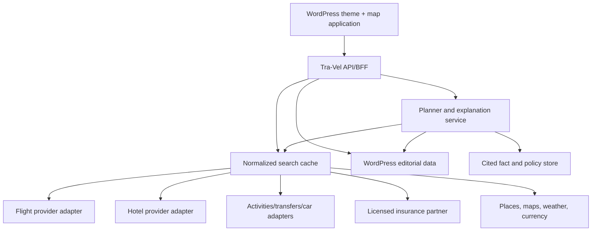

# Tra-Vel V2 product and launch blueprint

Date: 2026-07-16
Status: Tra-Vel V2 1.12.0 is the upcoming production release. It adds in-place AI clarification and request revisioning to the Budapest and Thailand flagship hubs, direct WordPress delivery pipeline, native 3D globe and global public-copy integrity gate covering core and Yoast output. Live supplier integrations, transactional booking, complete account flows and the remaining destination clusters are still in progress.

## Product thesis

Tra-Vel V2 is not another inventory grid. It is a Hebrew, mobile-first travel decision system in which the map is the primary interface and every piece of content, inventory, advice, and commerce answers one question: **what should I do next, and why?**

The commercial breadth should meet or exceed the leading Israeli agencies while the product experience should feel original:

- Flights, hotels, dynamic packages, organized trips, insurance, transfers, car rental, eSIM, attractions, cruises, and later financial products.
- A proactive globe that exposes price, weather, travel time, total cost, route risk, and trade-offs.
- AI-assisted intent capture and itinerary explanation, never an untraceable black-box booking decision.
- Deep Hebrew destination guides connected directly to relevant map states and bookable products.
- Clear distinction between live supplier facts, editorial recommendations, sponsored placement, affiliate links, and illustrative prototype data.

## Competitive baseline

| Product | What it proves | What Tra-Vel keeps | What Tra-Vel changes |
|---|---|---|---|
| [ISSTA](https://www.issta.co.il/) | Israeli users expect a wide product catalog, strong package merchandising, and direct search | Commercial completeness and recognizable travel categories | Replace tab-heavy, inventory-first discovery with an intent-first globe and decision explanations |
| [Eshet Tours](https://www.eshet.com/) | Packages, organized tours, flights, and hotels need immediate visibility | Prominent product entry points and offer confidence | Reduce header density; unify products around the journey rather than separate silos |
| [Gulliver](https://www.gulliver.co.il/) | Deal-led price presentation remains important in Israel | Actionable price cards and local commercial language | Add total-cost context, quality signals, and route trade-offs |
| [Travelist](https://www.travelist.co.il/) | Comparison is a distinct user need | Multi-supplier comparison and transparency | Visualize comparison geographically and explain why one option wins |
| [Booking.com](https://developers.booking.com/demand/docs/open-api/demand-api) | Rich filters, coordinates, availability, pricing, and accommodation detail are table stakes | Structured hotel inventory, policy detail, coordinates, currency handling | Combine hotel inventory with route, guide, and complete trip cost |
| [Google Flights](https://www.google.com/travel/flights) | Flexible destination and date exploration is powerful | Explore-anywhere, fare context, flexible dates | Add hotels, insurance, itinerary consequences, and Hebrew editorial knowledge |
| [KAYAK Explore](https://www.kayak.com/explore) | Price pins make budget discovery intuitive | Map prices and budget filters | Move from passive pins to proactive route and product recommendations |
| [Rome2Rio](https://www.rome2rio.com/) | Travelers need multimodal route understanding | Door-to-door route alternatives | Add bookable total cost, reliability, baggage, and Israeli-origin context |
| [Expedia](https://www.expedia.com/) | Trip planning is moving toward AI comparison and activity planning | Conversational planning and property comparison | Keep every AI suggestion inspectable, sourced, and editable on the map |

The design must not reproduce a competitor's copyrighted layout, brand assets, copy, icons, or content. Competitive research defines expected capability and information hierarchy; Tra-Vel owns its visual language and implementation.

## Experience architecture

### Primary journeys

1. **I know the destination** — choose origin/destination, compare direct and connecting routes, then layer hotel and trip costs.
2. **I know the budget** — set budget, dates, people, and comfort constraints; the globe proposes reachable destinations.
3. **I know the feeling** — describe beach, food, children, pace, climate, or accessibility; AI converts intent into visible filters and an editable route.
4. **I am researching** — enter through an SEO guide, understand the destination, open the guide's exact map state, then compare products.
5. **I need confidence** — inspect baggage, cancellation, connection protection, neighborhood, weather, insurance, disclosures, and total cost before leaving Tra-Vel for a supplier.

### Information architecture and mega menu

- **Book**: flights, hotels, flight + hotel, packages, organized tours, cruises.
- **Trip essentials**: insurance, transfers, car rental, eSIM, attractions, airport services.
- **Explore**: smart globe, price calendar, direct-flight map, weather map, school-holiday ideas.
- **Destinations**: continent → country → region/city/island → neighborhood/airport.
- **Travel styles**: family, couples, solo, accessible travel, kosher travel, luxury, budget, long trip.
- **Guides**: planning, flights, money, insurance, airports, entry rules, route collections.
- **Account**: saved trips, price watches, recent comparisons, bookings/partner hand-offs.

Desktop uses a visual mega menu with two task columns and one contextual feature. Mobile uses a compact drawer plus persistent bottom actions for Home, Map, Search, and AI Planner.

## The proactive globe

### Visual layers

1. Earth/globe base with country and city labels.
2. Airports, direct-flight arcs, connection hubs, rail/ferry/road segments.
3. Price pins for flight-only, hotel-only, and complete-trip estimates.
4. Weather, seasonality, visa/entry, safety, accessibility, and disruption overlays.
5. Editorial layers: recommended areas, route chapters, warnings, and guide highlights.
6. Personal state: budget envelope, saved pins, rejected options, and itinerary order.

### A pin is a decision object

Selecting a pin opens:

- Destination photo and one-sentence fit.
- Current flight range with timestamp and source.
- Typical hotel cost for the selected party and dates.
- Total trip estimate, including baggage, transfers, insurance, and known fees.
- Direct/connection duration and connection protection.
- Weather and season fit.
- “Why this is recommended,” “what you give up,” and a confidence level.
- Actions: compare routes, add stop, open guide, watch price, view hotel, build complete trip.

### Example: Tel Aviv to Thailand

The user selects Israel and Thailand. The decision engine can present:

- Direct EL AL: highest convenience, shortest elapsed time, known baggage and change policy.
- One protected booking via Dubai: lower fare, longer elapsed time, single-ticket connection.
- Athens stopover with separate tickets: lowest fare and optional city break, but higher missed-connection and baggage risk.

Every option carries a normalized complete cost, not just an advertised base fare.

### Map technology decision

Shortlist:

- [Mapbox GL JS globe](https://docs.mapbox.com/mapbox-gl-js/example/globe/) for a highly customized branded globe and efficient web rendering.
- [Google Maps 3D](https://developers.google.com/maps/documentation/javascript/3d) when photorealistic landmarks, familiar places data, and 3D popovers are worth the higher platform coupling.

Recommendation: prototype the product interaction on Mapbox first, keep a provider adapter, and test Google Places/3D for selected destination-detail experiences. Never couple commercial inventory IDs directly to map-provider IDs; use Tra-Vel canonical place IDs.

## Data and supplier architecture

### Provider categories required

- Flight shopping, schedules, fare families, baggage, ticketing/affiliate hand-off, and disruption status.
- Accommodation search, availability, room/rate policies, taxes, coordinates, images, and reviews under a valid license.
- Activities, transfers, cars, rail/ferry where commercially viable.
- Insurance from a licensed Israeli insurance provider/agency with approved wording and regulated disclosures.
- Places/geocoding, time zones, weather/climate, currency conversion, airport reference data, and entry-rule sources.

Potential commercial integrations must be evaluated by contract, Israeli availability, caching rights, rate limits, attribution, payout, cancellation liability, and whether Tra-Vel is an affiliate, agency, merchant, or marketplace. No prototype price may be relabeled “live” until its timestamp, currency, occupancy, inclusions, and supplier can be reproduced.

### Canonical data objects

- `Place`: Tra-Vel ID, provider mappings, type, parent, coordinates, timezone, localized names.
- `Airport`: IATA/ICAO, terminals, connections, city relationships, minimum connection data.
- `Offer`: provider, product type, price components, currency, availability timestamp, policies, hand-off URL.
- `Route`: ordered legs, transport modes, protected/unprotected connections, elapsed time, reliability signals.
- `TripCost`: fare, baggage, lodging, ground transport, insurance, fees, currency assumptions, party size.
- `GuideFact`: claim, value, source URL, retrieved date, review date, locale, editor.
- `Recommendation`: candidate, reasons, trade-offs, evidence references, confidence, user constraints.

## AI product rules

The planner can:

- Convert natural language into visible filters.
- Rank destinations and routes against explicit constraints.
- Explain price/time/risk trade-offs.
- Suggest stopovers, date shifts, itinerary order, and relevant products.
- Generate a draft itinerary that the user edits on the map.
- Answer questions using current supplier data and cited editorial facts.

The planner must not:

- Invent live prices, availability, entry rules, policy terms, or insurance coverage.
- Hide sponsored ranking.
- make regulated insurance recommendations without the approved partner flow.
- Book or transmit personal data without a clear user action and consent.

Every answer should distinguish live data, cached data, historical/typical data, editorial judgment, and AI inference.

## SEO and AEO system

### Site hierarchy

- `/destinations/{continent}/`
- `/destinations/{continent}/{country}/`
- `/destinations/{country}/{region-or-city}/`
- `/airports/{iata}/`
- `/routes/{origin}-{destination}/`
- `/guides/{topic}/`
- `/deals/` for expiring commercial inventory, separate from evergreen guides.

Faceted map URLs are noindex/canonicalized unless they represent a reviewed, useful landing page. Parameter combinations must not create crawl traps.

### Destination guide standard

A flagship guide normally exceeds 5,000 Hebrew words because the subject requires depth—not because search engines reward a word quota. Google explicitly favors helpful, people-first content and does not prescribe a preferred word count: [Helpful content guidance](https://developers.google.com/search/docs/fundamentals/creating-helpful-content).

Required guide sections:

1. Decision-first summary and who the destination fits.
2. Interactive route/map state.
3. Best time by sub-region, price, climate, and crowding.
4. Flight strategies from Israel, airports, baggage, and connections.
5. Regions/neighborhoods and where to stay by traveler type.
6. Route options for different trip lengths.
7. Complete budgets at budget/balanced/premium levels.
8. Local transport and door-to-door transitions.
9. Entry, health, safety, accessibility, connectivity, and money.
10. Insurance considerations with regulated boundaries.
11. Common mistakes and alternative decisions.
12. FAQ derived from real search and support questions.
13. Sources, author/reviewer, last checked, methodology, disclosures.
14. Contextual product modules that match the section instead of generic banners.

Structured data can include Organization, WebSite, BreadcrumbList, Article, FAQPage only when visible content qualifies, and Product/Offer only when actual offer data and policies meet Google's requirements. Schema must not describe demo prices.

### Content operations

- One canonical keyword/topic owner per page to prevent cannibalization.
- Source packet and outline before generation.
- AI-assisted draft with human fact, tone, legal, and commercial review.
- Automated checks for unsupported dates/prices, missing citations, duplicate passages, broken links, stale facts, title/canonical/schema conflicts.
- Scheduled review windows: volatile facts monthly/quarterly; evergreen planning at least twice yearly.
- Every guide exposes a machine-readable updated date and a human-readable change log.

## Commerce and trust

Revenue paths:

- Affiliate/agency commission for flights, hotels, packages, transfers, cars, eSIM, and attractions.
- Insurance referral or sale only through the appropriate licensed structure.
- Qualified itinerary/concierge service.
- Sponsored placements explicitly labeled and excluded from organic recommendation logic.
- Price alerts and saved-trip retention.

Trust requirements:

- Show the supplier and hand-off point before leaving Tra-Vel.
- Explain whether Tra-Vel is seller, agent, comparison service, or publisher for each product.
- Show taxes, fees, baggage, occupancy, cancellation, currency, and price timestamp.
- Separate editorial ranking from commercial placement.
- Israeli privacy/cookie, accessibility, consumer, email/WhatsApp consent, and insurance wording review before production.

## Technical platform

### Repository responsibilities

- `theme/tra-vel-v2`: presentation, accessible interactions, WordPress templates, progressive enhancement.
- Future `plugins/tra-vel-core`: destinations, routes, offers, provider adapters, REST endpoints, jobs, caching, consent-safe saved trips.
- WordPress: editorial source of truth, authorship, revisions, taxonomy, schema inputs.
- External BFF/API: supplier credentials, normalized search, rate limiting, caching, observability, and AI orchestration.

Supplier secrets must never be placed in the theme or browser. The initial CSS globe is an approval prototype; production geography and inventory move to the map provider and normalized API.

### Quality budgets

- Mobile-first responsive behavior at 360px and above.
- WCAG 2.2 AA target, logical RTL focus order, keyboard map alternative, reduced-motion support.
- No layout-blocking third-party widgets above the fold.
- Core Web Vitals monitored by template and device.
- Search results cached by normalized query; availability revalidated at hand-off.
- Error states explain stale/unavailable prices without fabricating alternatives.

## What is required to put V2 online

### Hosting and release

- Verified uPress account access and authenticated WordPress Application Password connection.
- Protected GitHub production environment and REST deployment secrets described in `DEPLOYMENT_PIPELINE.md`.
- Current production backup and tested rollback.
- Staging cache/CDN purge method.

### WordPress

- Confirm current plugins, Elementor dependencies, SEO plugin, redirects, forms/CRM, and active content model.
- Create/assign Map and Destination page templates.
- Preserve useful lead attribution and CRM behavior in a companion plugin, not coupled to the new theme.
- Migrate current Budapest, Prague, Vienna, route, flight, and insurance content into the new hierarchy with redirects where needed.

### Commercial/data

- Signed supplier/affiliate agreements and production credentials.
- Map/places account with billing limits and attribution approval.
- Insurance partner and approved journey/wording.
- Price methodology, currency, caching, and stale-data policy.
- Product owner for offer QA and failed hand-offs.

### Legal and governance

- Hebrew legal review of terms, privacy/cookies, accessibility statement, affiliate/sponsored disclosure, consumer pricing, and insurance boundaries.
- Data retention and deletion rules for saved trips and leads.
- Editorial authors/reviewers with published credentials and correction policy.

### Measurement

- GA4/GTM, Search Console, consent mode, server-side conversion events where appropriate.
- Funnel: map engagement → route comparison → offer detail → supplier hand-off → confirmed conversion where data is returned.
- Guardrails: price mismatch, unavailable offer, booking hand-off failure, complaint/refund rate, Core Web Vitals, organic landing-page quality.

## Delivery phases

1. **Foundation** — approved theme, CI/CD, direct upload with rollback, content migration inventory, analytics baseline.
2. **Useful globe** — real places/airports, direct routes, historical/typical price exploration, accessible list alternative.
3. **Live commerce** — first flight/hotel provider, total-cost normalization, hand-off tracking, disclosures.
4. **Destination system** — Thailand flagship guide, Europe migration, topic clusters, author/reviewer and freshness workflows.
5. **AI planner** — constraint extraction, cited recommendation explanations, editable itineraries, evaluation suite.
6. **Expansion** — insurance, transfers, activities, multimodal routes, personalization, price alerts.

Production should not be activated merely because the theme ZIP installs. The minimum production gate is: staging visual approval; no demo claims presented as live; working navigation and critical URLs; verified forms/analytics/consent; legal disclosures; backup/rollback; and at least one commercially complete supplier journey.
